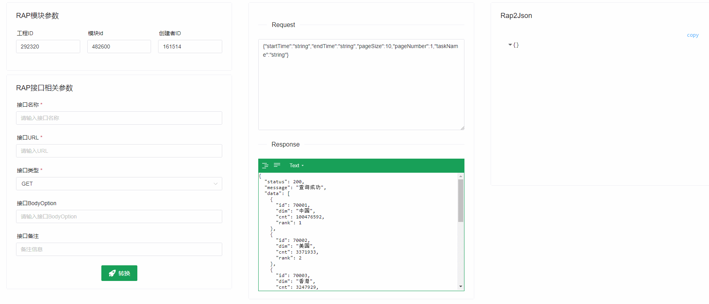
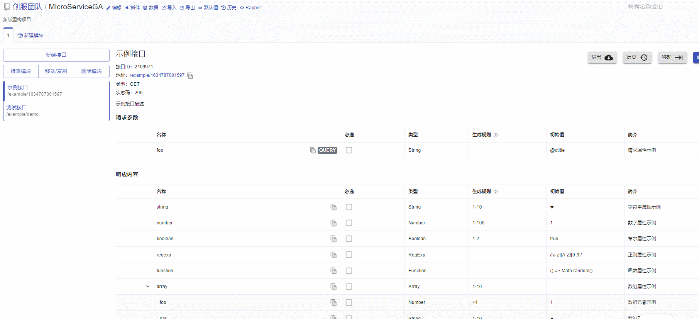

# Mock2Rap2

convert mockjs into RAP2 import backup JSON

[在线预览online](https://yelingfeng.github.io/MocktoRap2/)

## Feature
- :rocket:  快速创建RAP2接口 
- :airplane: 支持在线编辑JSON
- :helicopter: 支持mockjs规则和纯json数组格式


## Screenshot

Mock2Rap2


ImportRAP2



## Example

### 1. Request

```js
 {
    startTime: 'string',
    endTime: 'string',
    pageSize: 10,
    pageNumber: 1,
    taskName: 'string'
  }
```

### 2. Response
1. mock格式
```js
{
  'rows|18': [{
      'compKey|+1': [
        '30001',
        '30002',
        '30003',
        '30005',
        '80008',
        '70004',
        '80001',
        '80002',
        '80003',
        '90001',
        '90002',
        '80005',
        '80004',
        '90003',
        '90004',
        '80006',
        '80007',
        '80010'
      ],
      'compValue|+1': [
        'aaaaa',
        'bbbb',
        'cccc',
        'ddddd',
        'eeeee',
        'fffff',
        'ggggg',
        'hhhhh',
        'iiiii',
        'jjjjj',
        'kkkkk',
        'lllll',
        'mmmmm',
        'nnnnn',
        'oooo',
        'ppppp',
        'qqqq'
      ]
    }
  ],
  message: '保存成功',
  status: '200'
}
```

2. json数据格式

```js
{
  status: 200,
  message: '查询成功',
  data: [
    {
      id: 70001,
      dim: '中国',
      cnt: 100476592,
      rank: 1
    },
    {
      id: 70002,
      dim: '美国',
      cnt: 3371933,
      rank: 2
    },
    {
      id: 70003,
      dim: '香港',
      cnt: 3247929,
      rank: 3
    },
    {
      id: 70008,
      dim: '未知',
      cnt: 2533189,
      rank: 4
    },
    {
      id: 70010,
      dim: '缅甸',
      cnt: 2130736,
      rank: 5
    },
    {
      id: 70011,
      dim: '印度',
      cnt: 1867044,
      rank: 6
    },
    {
      id: 70009,
      dim: '尼日利亚',
      cnt: 1463565,
      rank: 7
    }
  ],
  total: 10
}

```

3. 对象格式

```js
 {
    data: {
      taskBaseId: '123',
      taskName: 'ddd',
      taskCreateTime: '2222'
    },
    message: '保存成功',
    status: '200'
  }

```


## Thanks
template by vuecomponent-seed
[vuecomponent-seed](https://github.com/zouhangwithsweet/vuecomponent-seed) 
